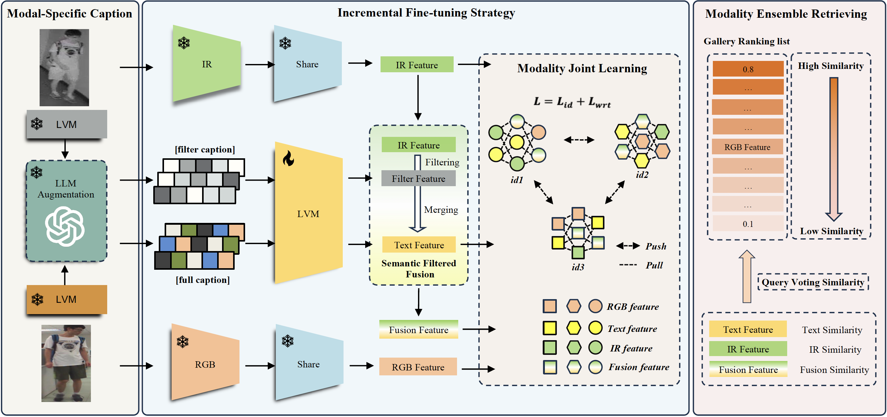
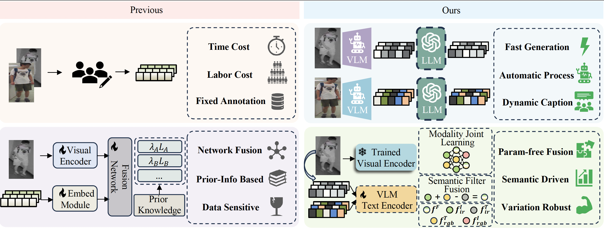

<!-- <object data="../files/overview-framework.pdf" type="application/pdf" weight="700px">
    <embed src="../files/overview-framework.pdf">
        
This browser does not support PDFs. Please <a href="../files/overview-framework.pdf">download the PDF</a> to view.

    </embed>
</object> -->
<!-- 插入图片-->
## The Overview of the proposed TVI-LFM

## Idea of our method

## Abstract
Visible-Infrared Person Re-Identification (VI-ReID) is a challenging cross-modal pedestrian retrieval task due to the lack of critical information in the infrared modality, such as color. Existing methods focus on mining modality-shared features but ignore the lack of information. The development of Large Language Models (LLM)s and Vision Language Models (VLM)s motivates us to explore a feasible solution to complement missing vital information with off-the-shelf foundation models. To this end, we propose a novel Text-enhanced VI-ReID framework driven by Large Foundation Models (TVI-LFM), consisting of Modal-Specific Caption (MSC), Incremental Fine-tuning Strategy(IFS), and Modality Ensemble Retrieval(MER). The basic idea is to enrich infrared representations with generated text, which is a cross-modality retrieval approach bolstered by heterogeneous textual descriptions. Specifically, to enrich the infrared modality with text, MSC employs LLM to augment VLM-generated textual descriptions. Meanwhile, IFS incorporates a pre-trained multi-modal VLM to extract text features, and incrementally fine-tunes it by aligning semantics across all modalities, minimizing the domain gap between generated texts and original visual images. This allows the text model to learn complementary features from the infrared modality while ensuring that text features maintain a stable semantic representation of overall pedestrian appearance. By leveraging text-visual alignment capability of fine-tuned VLM, the framework is able to create fusion modality with a semantic structure the same as the visible modality in a parameter-free manner. Additionally, MER leverages the complementary strengths of each query modality to form ensemble queries, further improving retrieval performance.

<!-- 
Download <a href="https://whu-hzy.github.io/files/2024_NIPS_HZY_TVI_FM.pdf">here</a>
 -->