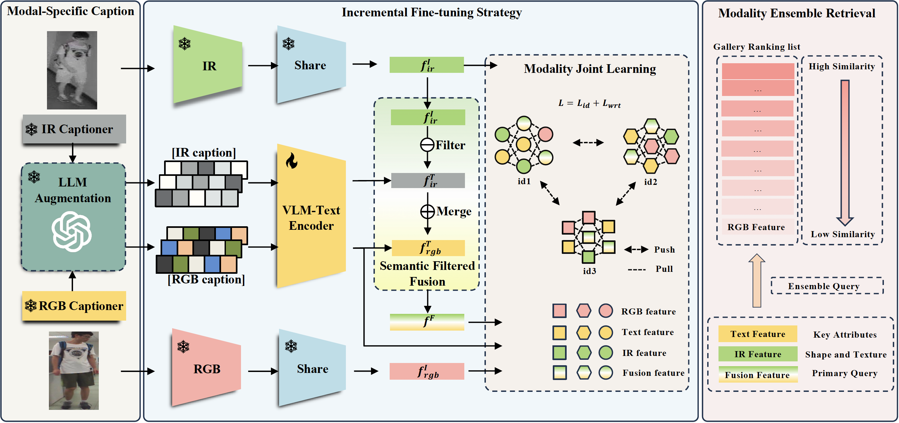

<!-- <object data="../files/overview-framework.pdf" type="application/pdf" weight="700px">
    <embed src="../files/overview-framework.pdf">
        
This browser does not support PDFs. Please <a href="../files/overview-framework.pdf">download the PDF</a> to view.

    </embed>
</object> -->
<!-- 插入图片-->

Visible-Infrared Person Re-identification (VI-ReID) often underperforms compared to RGB-based ReID due to significant modality differences, primarily caused by the absence of detailed information in the infrared modality. The development of foundation models like Large Language Models (LLMs) and Language Vision Models (LVMs) motivates us to investigate a feasible solution to empower existing VI-ReID backbones with off-the-shelf foundation models. To this end, we propose a novel Text-enhanced VI-ReID framework driven by Foundation Models (TVI-FM). The basic idea is to enrich the representation of the infrared modality with textual descriptions automatically generated by LVMs. Specifically, we incorporate a pre-trained LVM to extract textual features from descriptions generated by two modal-specialized fine-tuned LVM captioners and augmented by LLM. To enrich infrared features with generated textual information, we use modality alignment capabilities of LVMs and LVM-Generated feature-level filters to create a preliminary fusion modality. This enables the text model to learn complementary features according to the infrared modality, ensuring semantic consistency between the fusion and visible modalities. Then, modality joint learning aligns features of all modalities, incrementally fine-tunes text encoder to adapt to frozen VI-ReID backbone, maintaining stability of overall semantic of text representations while refining text-enriched infrared representations, thus minimizing the domain gap between enriched infrared and visible modalities. Additionally, Modality Ensemble Retrieving is proposed to leverage complementary strengths of each query modality to improve retrieval performance and robustness. Extensive experiments demonstrate that our method significantly improves retrieval performance on three expanded cross-modal re-identification datasets, paving the way for utilizing foundation models in downstream data-demanding tasks. The code will be released.

Download <a href="https://whu-hzy.github.io/files/2024_NIPS_HZY_TVI_FM.pdf">here</a>
